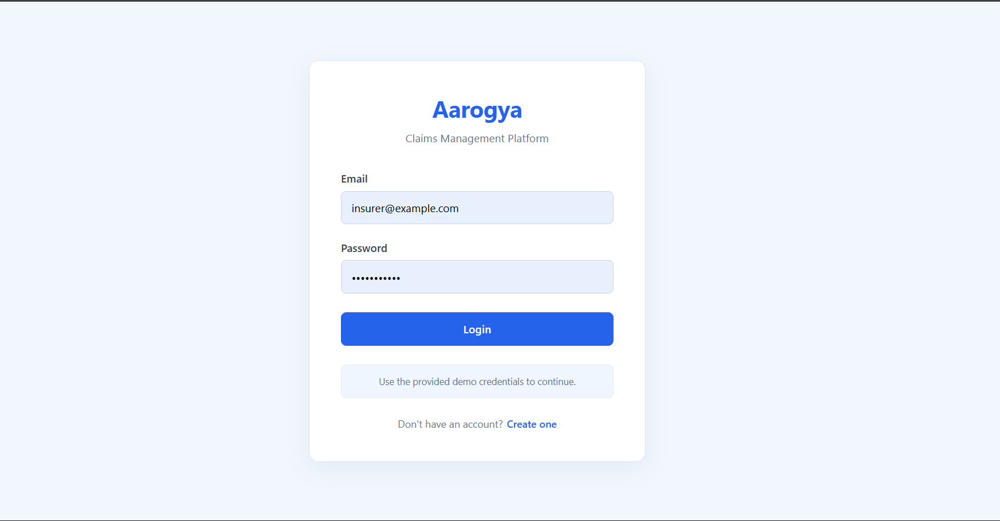
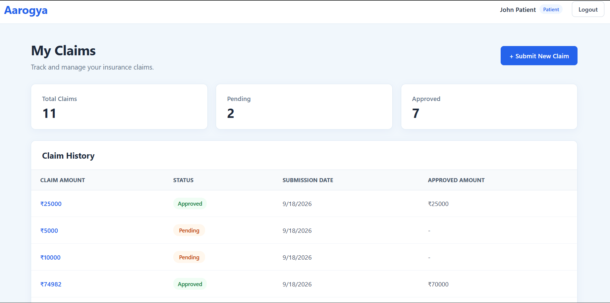
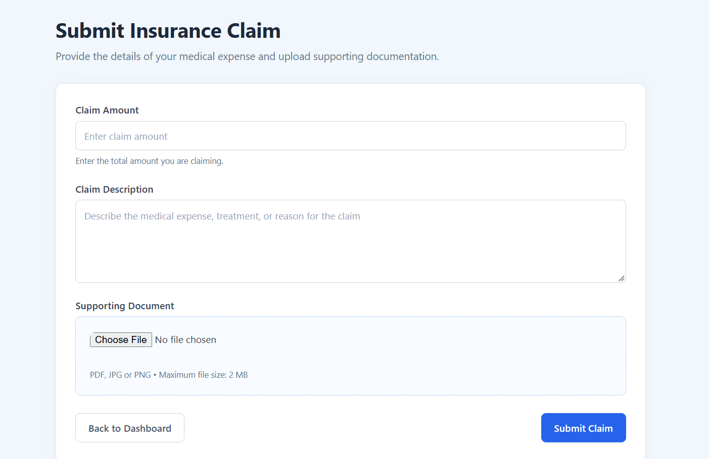
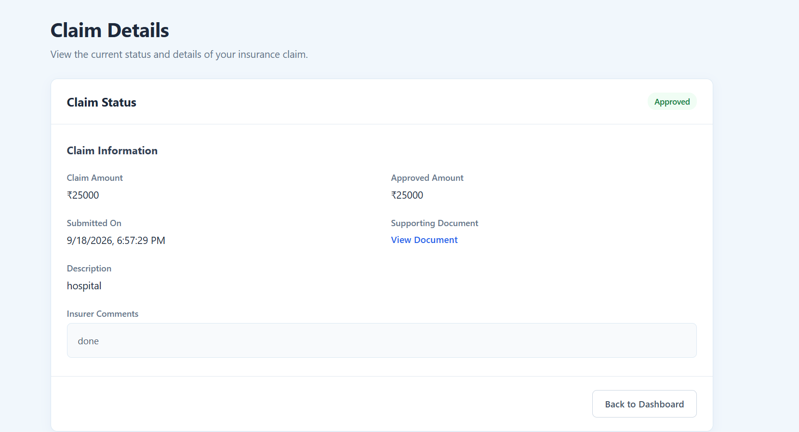
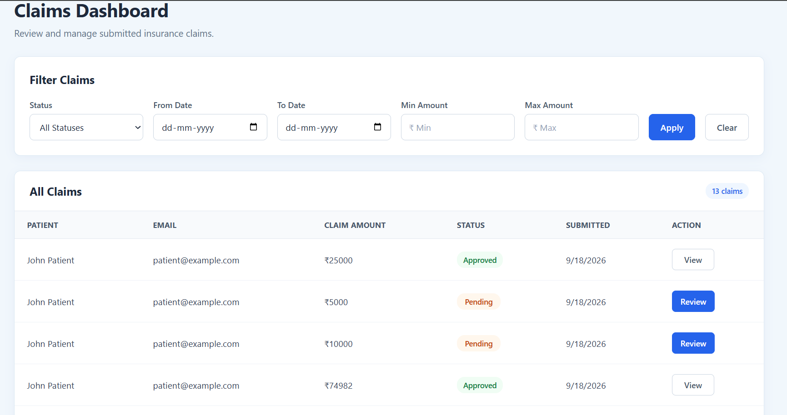
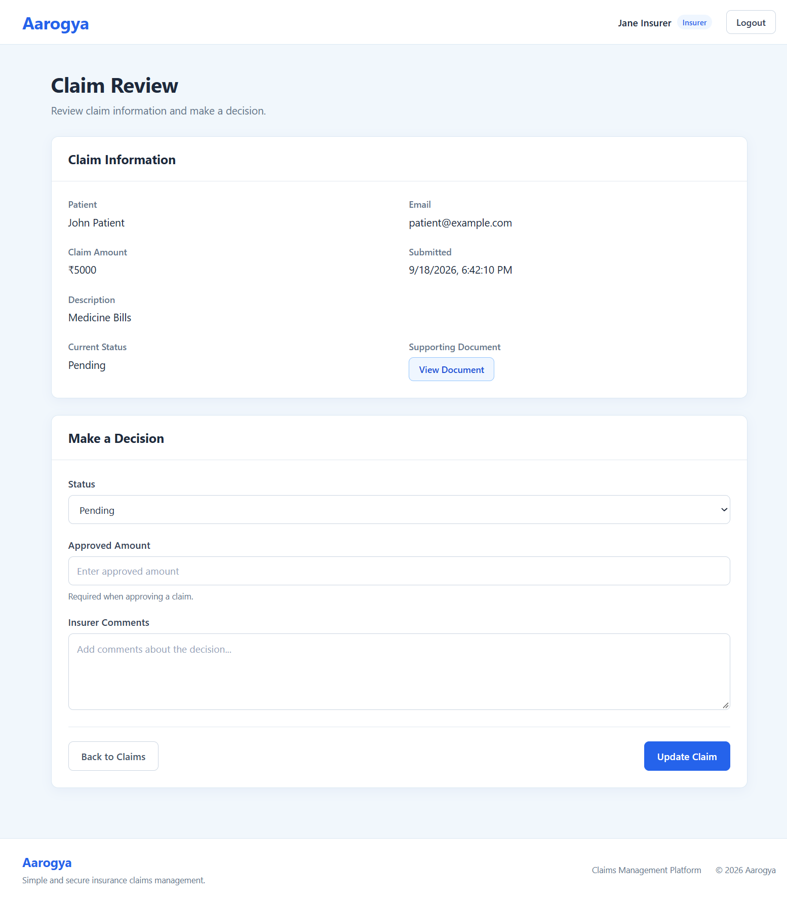

# Aarogya – Claims Management Platform

A full-stack insurance claims management platform with separate **Patient** and **Insurer** portals.

Patients can submit insurance claims with supporting documents and track their claim status, while insurers can review, filter, approve, or reject claims through a dedicated dashboard.

**Live Demo:** [https://aarogya-claims-platform.vercel.app/]

---

## Overview

Aarogya is a minimal claims management platform developed as part of a full-stack engineering assessment.

The application implements two role-based workflows:

### Patient Portal

- Register and log in
- Submit insurance claims
- Upload supporting documents
- View previously submitted claims
- Track claim status
- View approved amount and insurer comments
- Open uploaded supporting documents

### Insurer Portal

- Log in as an insurer
- View all submitted claims
- Filter claims by:
  - Status
  - Submission date
  - Claim amount
- View complete claim details
- View uploaded supporting documents
- Approve or reject claims
- Enter approved amount
- Add insurer comments

---

## Key Features

### Authentication & Authorization

- JWT-based authentication
- Password hashing using bcrypt
- Role-based access control
- Protected patient and insurer routes
- Users can only access functionality permitted for their role
- Patients can only access their own claims

### Claims Management

- Create new claims
- Persistent claim storage using MongoDB
- Claim status workflow:
  - `Pending`
  - `Approved`
  - `Rejected`
- Approved amount validation
- Insurer comments
- Submission date tracking

### Document Uploads

- Supporting documents can be uploaded in:
  - PDF
  - JPG
  - PNG
- Maximum file size: 2 MB
- Files are uploaded to Cloudinary
- Documents are stored separately from the application server
- Uploaded documents can be viewed from the claim details page

### Responsive UI

- Responsive patient and insurer dashboards
- Reusable layout components
- Loading and error states
- Protected route handling
- Custom 404 and unauthorized pages

---

## Tech Stack

### Frontend

- React
- Vite
- React Router
- Axios
- Context API
- CSS

### Backend

- Node.js
- Express.js
- JWT
- bcryptjs
- Multer

### Database

- MongoDB
- Mongoose
- MongoDB Atlas

### File Storage

- Cloudinary

### Deployment

- Vercel – Frontend
- Render – Backend
- MongoDB Atlas – Database
- Cloudinary – Document storage

---

## System Architecture

```text
                         ┌─────────────────────┐
                         │       User          │
                         │ Patient / Insurer   │
                         └──────────┬──────────┘
                                    │
                                    │ HTTPS
                                    ▼
                         ┌─────────────────────┐
                         │   Vercel Frontend   │
                         │ React + Vite        │
                         └──────────┬──────────┘
                                    │
                                    │ REST API
                                    ▼
                         ┌─────────────────────┐
                         │   Render Backend    │
                         │ Node + Express      │
                         └──────┬──────┬───────┘
                                │      │
                  ┌─────────────┘      └─────────────┐
                  ▼                                  ▼
        ┌───────────────────┐              ┌──────────────────┐
        │   MongoDB Atlas   │              │    Cloudinary    │
        │ Claims + Users    │              │ Supporting Docs  │
        └───────────────────┘              └──────────────────┘
```

---

### Role Permissions

| Feature              | Patient | Insurer |
| -------------------- | :-----: | :-----: |
| Register             |    ✓    |    ✓    |
| Login                |    ✓    |    ✓    |
| Submit Claim         |    ✓    |    —    |
| View Own Claims      |    ✓    |    —    |
| View All Claims      |    —    |    ✓    |
| Filter Claims        |    —    |    ✓    |
| View Claim Details   |    ✓    |    ✓    |
| Approve Claim        |    —    |    ✓    |
| Reject Claim         |    —    |    ✓    |
| Add Insurer Comments |    —    |    ✓    |

---

## API Endpoints

### Authentication

| Method | Endpoint             | Access        | Description         |
| ------ | -------------------- | ------------- | ------------------- |
| POST   | `/api/auth/register` | Public        | Register a new user |
| POST   | `/api/auth/login`    | Public        | Authenticate a user |
| GET    | `/api/auth/me`       | Authenticated | Get current user    |

### Claims

| Method | Endpoint          | Access            | Description                 |
| ------ | ----------------- | ----------------- | --------------------------- |
| POST   | `/api/claims`     | Patient           | Submit a new claim          |
| GET    | `/api/claims/my`  | Patient           | Get patient's claims        |
| GET    | `/api/claims`     | Insurer           | Get all claims with filters |
| GET    | `/api/claims/:id` | Patient / Insurer | Get claim details           |
| PATCH  | `/api/claims/:id` | Insurer           | Approve or reject a claim   |

---

## Database Schema

### User

```text
User
├── name
├── email
├── password
├── role
└── timestamps
```

Roles:

```text
patient
insurer
```

### Claim

```text
Claim
├── patientId
├── name
├── email
├── claimAmount
├── description
├── documentUrl
├── status
├── submissionDate
├── approvedAmount
├── insurerComments
└── timestamps
```

Claim statuses:

```text
Pending
Approved
Rejected
```

The `patientId` establishes a relationship between a claim and the patient who submitted it.

---

## Validation & Business Rules

The backend validates important business rules instead of relying only on frontend validation.

Examples:

- Claim amount and description are required.
- Supporting document is required.
- Only PDF, JPG, and PNG documents are accepted.
- Maximum document size is 2 MB.
- Only valid claim statuses can be submitted.
- Approved amount cannot be negative.
- Approved amount cannot exceed the original claim amount.
- A claim can only be decided while its status is `Pending`.
- Patients cannot access another patient's claim.
- Insurer-only endpoints cannot be accessed by patients.
- New claims are created with `Pending` status.
- Only `Approved` or `Rejected` can be used when deciding a pending claim.

---

## Project Structure

```text
aarogya/
│
├── client/
│   ├── public
│   │
│   ├── src/
│   │   ├── components/
│   │   │   ├── common/
│   │   │   └── layout/
│   │   │
│   │   ├── contexts/
│   │   │   └── AuthContext.jsx
│   │   │
│   │   ├── pages/
│   │   │   ├── auth/
│   │   │   ├── patient/
│   │   │   ├── insurer/
│   │   │   └── errors/
│   │   │
│   │   ├── services/
│   │   │   └── api.js
│   │   │
│   │   ├── App.jsx
│   │   └── main.jsx
│   │
│   └── package.json
│
└── server/
    ├── config/
    ├── controllers/
    ├── middleware/
    ├── models/
    ├── routes/
    ├── seed/
    ├── utils/
    ├── server.js
    └── package.json
```

---

## Local Development

### 1. Clone the repository

```bash
git clone https://github.com/Shivraj2615/aarogya-claims-platform
cd aarogya-claims-platform
```

### 2. Install frontend dependencies

```bash
cd client
npm install
```

### 3. Install backend dependencies

Open another terminal:

```bash
cd server
npm install
```

### 4. Configure environment variables

Create a `.env` file inside the `server` directory.

```env
PORT=3000

MONGO_URI=your_mongodb_connection_string

JWT_SECRET=your_jwt_secret

CLOUDINARY_CLOUD_NAME=your_cloudinary_cloud_name
CLOUDINARY_API_KEY=your_cloudinary_api_key
CLOUDINARY_API_SECRET=your_cloudinary_api_secret
```

Create a `.env` file inside the `client` directory:

```env
VITE_API_URL=http://localhost:3000/api
```

### 5. Start the backend

```bash
cd server
node server.js
```

### 6. Start the frontend

```bash
cd client
npm run dev
```

The application will be available at the local Vite development URL.

---

## Demo Credentials

The project includes seeded demo accounts.

### Patient

```text
Email: patient@example.com
Password: password123
Role: Patient
```

### Insurer

```text
Email: insurer@example.com
Password: password123
Role: Insurer
```

For local development, demo users can be created using:

```bash
cd server
npm run dev
```

> Do not use these credentials for any real application or production system.

---

## Deployment

The application is deployed using separate services for each major layer.

| Layer        | Service       |
| ------------ | ------------- |
| Frontend     | Vercel        |
| Backend      | Render        |
| Database     | MongoDB Atlas |
| File Storage | Cloudinary    |

### Production Architecture

```text
Vercel
   │
   │ HTTPS
   ▼
Render
   │
   ├── MongoDB Atlas
   │
   └── Cloudinary
```

Environment variables are configured separately in the frontend and backend deployment environments.

Sensitive credentials such as database passwords, JWT secrets, and Cloudinary API secrets are not committed to the repository.

---

## Security Considerations

The project implements several basic security practices:

- Passwords are hashed using bcrypt.
- JWT secrets are stored in environment variables.
- Cloudinary credentials remain server-side.
- Protected API routes require authentication.
- Role-based authorization is enforced on the backend.
- Patient claim ownership is verified before returning claim details.
- Sensitive configuration values are excluded from Git.

### Production Improvement

For a production healthcare/insurance system, uploaded medical documents should use private or authenticated document delivery rather than publicly accessible URLs.

The current Cloudinary setup is intentionally simplified for the scope of this assessment.

---

## Assumptions

- Each claim belongs to one patient.
- Insurers can review all submitted claims.
- Only `Pending` claims can be approved or rejected.
- An approved claim must have an approved amount.
- Approved amount cannot exceed the original claim amount.
- Rejected claims do not have an approved amount.
- Supporting documents are limited to PDF, JPG, and PNG.
- Supporting documents are limited to 2 MB.
- Basic registration is available for both patient and insurer roles.

---

## Future Improvements

If this platform were extended beyond the assessment scope, potential improvements would include:

- Private/signed document URLs
- Pagination for large claim datasets
- Claim audit history
- Notifications for claim status changes
- Email notifications
- Advanced search
- Insurance policy management
- Claims analytics and reporting
- More granular insurer permissions
- Automated document validation
- Automated fraud/risk detection
- Comprehensive automated testing
- Rate limiting and additional API security
- Centralized logging and monitoring

---

## Screenshots

### Login



### Patient Dashboard



### Submit Claim



### Patient Claim Details



### Insurer Dashboard



### Claim Review



---

## Assessment Coverage

| Requirement              | Implementation |
| ------------------------ | -------------- |
| P-1 Submit Claim         | ✓              |
| P-2 View Claims          | ✓              |
| I-1 Claims Dashboard     | ✓              |
| I-2 Manage Claims        | ✓              |
| S-1 Authentication       | ✓              |
| S-2 API Endpoints        | ✓              |
| S-3 Database Persistence | ✓              |
| Document Upload          | ✓              |
| Role-based Access        | ✓              |
| Responsive UI            | ✓              |
| Production Deployment    | ✓              |

---

## Author

**Shivraj Jagdale**

Full-Stack Engineering Candidate

---

## License

This project was developed as a technical assessment project and is intended for demonstration and evaluation purposes.
